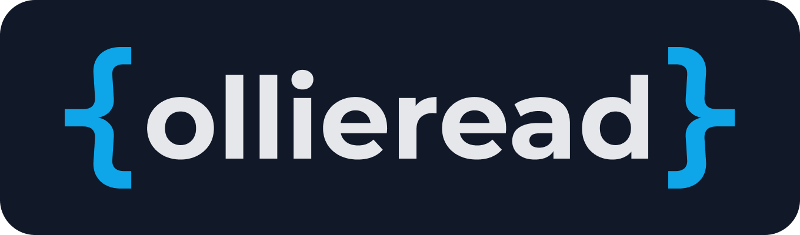

<h2 align="center">Hi there, I'm</h2>

<h3 align="center">and I'm a software architect and developer educator</h3>

I love building things with Laravel and PHP, tackling tricky problems, and helping other developers.
Whether it's through my open-source work, writing, or as a mentor/consultant.

<h3 align="center">I'm working on</h3>

 

 

 

<h3 align="center">You can also find me on</h3>

    <a href="https://ollieread.com">My Website</a>
    | <a href="https://x.com/ollieread.com">X (Formerly Twitter)</a>
    | <a href="https://bsky.app/profile/ollieread.com">BlueSky</a>
    | <a href="https://www.linkedin.com/in/ollieread/">LinkedIn</a>

